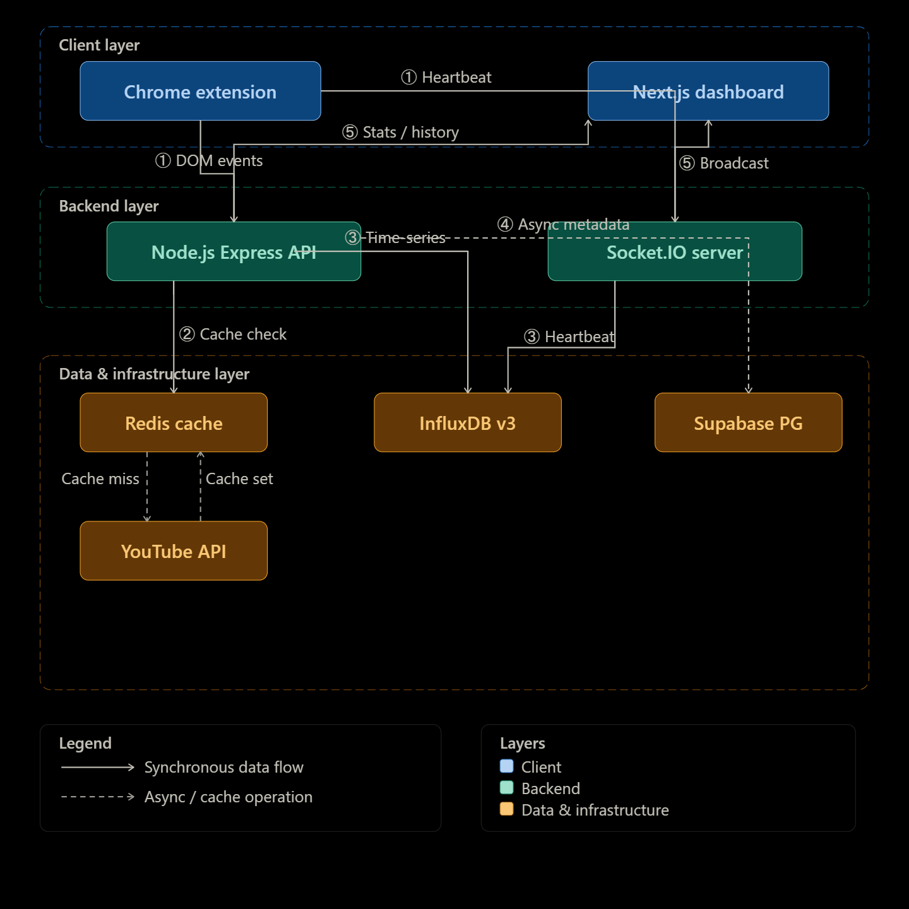

# 🎵 YouTube Tracker v2.0

> Hệ thống theo dõi và phân tích hành vi nghe nhạc trên YouTube theo thời gian thực.  
> Kiến trúc **3 tầng**: Chrome Extension (Agent) → Node.js API (Processor) → InfluxDB + Supabase (Storage).

---

## 📋 Mục lục

- [Tổng quan](#-tổng-quan)
- [Tính năng chính](#-tính-năng-chính)
- [Tech Stack](#️-tech-stack)
- [Kiến trúc hệ thống](#-kiến-trúc-hệ-thống)
- [Cấu trúc thư mục](#-cấu-trúc-thư-mục)
- [Cài đặt & Chạy](#-cài-đặt--chạy)
- [Biến môi trường](#-biến-môi-trường)
- [API Reference](#-api-reference)
- [Thuật toán cốt lõi](#-thuật-toán-cốt-lõi)
- [Database Schema](#-database-schema)
- [Kịch bản Test E2E](#-kịch-bản-test-end-to-end)
- [Trạng thái dự án](#-trạng-thái-dự-án)

---

## 🌟 Tổng quan

YouTube Tracker ghi nhận **chính xác** hành vi nghe nhạc của người dùng trên YouTube bao gồm:
- Thời gian nghe thực tế (ms_played), tỷ lệ xem (watch_duration_ratio)
- Phân loại hành vi: `play`, `pause`, `skip`, `skip_early`, `track_completed`, `replay`, `like`, `dislike`
- Ngữ cảnh: nguồn click (search, homepage, recommendation), thời điểm nghe (morning/afternoon/evening/night)

Dữ liệu được hiển thị trên **Dashboard Analytics** real-time với biểu đồ tương tác và hệ thống gợi ý nhạc.

---

## ✨ Tính năng chính

| # | Tính năng | Mô tả |
|---|-----------|-------|
| 1 | **Deep Tracking** | Đo chính xác ms đã nghe, tỷ lệ hoàn thành video, phát hiện skip/replay tự động |
| 2 | **Real-time Update** | Khi người dùng Play bài hát, Dashboard nhận thông báo tức thì qua Socket.IO |
| 3 | **Auth Sync** | Đăng nhập trên Web → Extension tự nhận diện qua Cookie sync (Supabase JWT) |
| 4 | **Music-Only Filter** | Chỉ tracking video thuộc danh mục Music / Entertainment / Blogs (qua YouTube API + Redis cache) |
| 5 | **Analytics Dashboard** | Biểu đồ: thời gian nghe 7 ngày, skip rate, top bài hát, phân phối thời gian nghe,....|
| 6 | **AI Recommendations** | Dự kiến |
---

## 🛠️ Tech Stack

| Layer | Công nghệ | Vai trò |
|-------|-----------|---------|
| **Agent** | Chrome Extension (Manifest V3) | DOM hook vào `<video>`, bắt sự kiện play/pause/skip, gửi telemetry |
| **Frontend** | Next.js 16 (App Router), Tailwind CSS v4, Recharts, Lucide Icons | Dashboard analytics, SSR Auth, biểu đồ tương tác |
| **Backend** | Node.js, Express, Socket.IO | REST API + WebSocket server, xử lý logic tracking |
| **Time-series DB** | InfluxDB v3 Core | Lưu hàng triệu sự kiện tracking theo chuỗi thời gian |
| **Relational DB** | Supabase (PostgreSQL) | Authentication, lưu metadata video cho AI dataset |
| **Cache** | Redis | Cache kết quả YouTube API (TTL 24h), cache recommendations (TTL 1h) |
| **External API** | YouTube Data API v3 | Phân loại video, lấy metadata, tìm video liên quan |

---

## 🏗 Kiến trúc hệ thống



### Luồng dữ liệu chính

1. **User xem video** → `content.js` hook vào `<video>` element, theo dõi `play`, `pause`, `ended`, `timeupdate`
2. **Phát hiện sự kiện** → Tính toán `ms_played`, `watch_duration_ratio`, phân loại `skip`/`track_completed`/`replay`
3. **Gửi về Backend** → `background.js` đính kèm JWT token, POST tới `/track`
4. **Backend xử lý** → Check YouTube API (có phải Music không?) → Redis cache → Ghi InfluxDB → Broadcast Socket.IO
5. **Metadata sync** → Fire & Forget: Lấy title/artist/tags từ YouTube API → UPSERT vào Supabase `videos` table
6. **Dashboard cập nhật** → Socket.IO nhận `new_track_event` → Hiển thị NowPlaying toast → Reload biểu đồ

---

## 📁 Cấu trúc thư mục

```
Youtube_Tracker/
├── .env                          # Biến môi trường (tokens, keys, DB config)
├── index.js                      # Entry point: require server/src/index.js
├── setup_supabase.sql            # Script tạo bảng videos trên Supabase
├── start_influxdbserver.bat      # Script khởi động InfluxDB local
│
├── extension/                    # ── CHROME EXTENSION (MANIFEST V3) ──
│   ├── manifest.json             # Cấu hình quyền, content scripts, background worker
│   ├── content.js                # ★ Core: DOM inject, tracking logic, event detection
│   ├── background.js             # Service worker: Auth cookie sync, API relay
│   ├── popup.html / popup.js     # UI popup khi click icon extension
│   └── icons/                    # Icon extension các kích thước
│
├── server/                       # ── BACKEND NODE.JS ──
│   └── src/
│       ├── index.js              # ★ Main: Express routes, Socket.IO setup, tất cả API endpoints
│       ├── db/
│       │   ├── influx.js         # InfluxDB v3 client, hàm writePlaybackEvent()
│       │   └── redis.js          # Redis client singleton, hàm cacheGet()
│       ├── middleware/
│       │   └── authMiddleware.js # JWT verification qua Supabase getUser()
│       ├── services/
│       │   └── youtubeService.js # YouTube API: checkCategory, getDetails, persistMetadata
│       └── sockets/
│           └── trackingHandler.js# Socket.IO: auth middleware, heartbeat handler, room join
│
├── dashboard/                    # ── FRONTEND NEXT.JS 16 ──
│   ├── app/
│   │   ├── layout.tsx            # Root layout
│   │   ├── page.tsx              # Landing / redirect
│   │   ├── login/                # Trang đăng nhập Supabase Auth
│   │   ├── auth/                 # Auth callback handler
│   │   └── dashboard/
│   │       ├── layout.tsx        # Dashboard layout (sidebar, SyncToken)
│   │       ├── page.tsx          # ★ Trang analytics chính
│   │       └── recommendations/
│   │           └── page.tsx      # Trang gợi ý nhạc AI
│   ├── components/
│   │   ├── charts/               # TimeChart, SkipRateChart, ContextPieChart (Recharts)
│   │   ├── dashboard/            # NowPlayingCard, TopVideosCard, TotalPlaytimeCard
│   │   ├── history/              # HistoryTable
│   │   ├── ui/                   # Shadcn UI components
│   │   └── SyncToken.tsx         # Sync Supabase JWT vào cookie cho Extension đọc
│   ├── hooks/
│   │   └── useSocket.ts          # Custom hook: kết nối Socket.IO với JWT auth
│   └── lib/
│       ├── api.ts                # Axios instance + interceptor tự gắn JWT
│       └── supabase/             # Supabase client (browser + server)
│
├── model/                        # Placeholder cho ML model tương lai
│   └── song.js
│
└── docs/                         # Tài liệu task breakdown
    ├── Task_1_Backend_Auth_Foundation.md
    ├── Task_2_Realtime_WebSockets.md
    ├── Task_3_WebApp_Dashboard.md
    ├── Task_4_Chrome_Extension_Sync.md
    ├── Task_5_Enhanced_Tracking.md
    └── Task_6_Analytics_Dashboard.md
```

---

## 🐳 Chạy bằng Docker (Khuyến nghị)

Cách nhanh nhất để khởi chạy toàn bộ hệ thống cho dev mới:

### Yêu cầu
- **Docker** & **Docker Compose** đã cài đặt
- **Supabase Project** (cloud) – Tạo tại [supabase.com](https://supabase.com) và chạy `setup_supabase.sql`

### Khởi chạy

```bash
# 1. Copy file env mẫu và điền các key thực
cp .env.example .env
# Chỉnh sửa .env: điền SUPABASE_URL, SUPABASE_ANON_KEY, YOUTUBE_API_KEY

# 2. Tạo InfluxDB token (sau khi container chạy lần đầu)
#    Xem hướng dẫn bên dưới

# 3. Build và khởi chạy toàn bộ hệ thống
docker compose up --build -d
```

### Tạo InfluxDB Token lần đầu

```bash
# Sau khi container influxdb chạy, exec vào để tạo token:
docker compose exec influxdb influxdb3 create token --admin

# Copy token xuất ra → Dán vào INFLUXDB_TOKEN trong file .env
# Restart lại server:
docker compose restart server
```

### Kết quả

| Service | URL |
|---------|-----|
| Dashboard | http://localhost:3000 |
| Backend API | http://localhost:5000 |
| InfluxDB | http://localhost:8181 |
| Redis | localhost:6379 |

> **Lưu ý:** Chrome Extension không chạy trong Docker. Dev vẫn cần Load Unpacked từ thư mục `extension/` (xem Bước 3 ở mục Manual Setup).

---

## 🚀 Cài đặt & Chạy (Manual)

### Yêu cầu tiên quyết

| Service | Địa chỉ mặc định | Ghi chú |
|---------|-------------------|---------|
| **Node.js** | - | v18+ |
| **InfluxDB v3 Core** | `http://localhost:8181` | Chạy `start_influxdbserver.bat` hoặc cài riêng |
| **Redis** | `redis://localhost:6379` | Cài Redis Server hoặc dùng Docker |
| **Supabase Project** | Cloud | Tạo project tại [supabase.com](https://supabase.com), chạy `setup_supabase.sql` |

### Bước 1: Backend Server

```bash
# Tại thư mục gốc Youtube_Tracker/
npm install
node index.js
# → Server chạy tại http://localhost:5000
# → Logs: [InfluxDB] Connected, [Redis] Connected, [Server] WebSocket ready
```

### Bước 2: Dashboard (Next.js)

```bash
cd dashboard
npm install
npm run dev
# → Dashboard chạy tại http://localhost:3000
```

Mở trình duyệt → `http://localhost:3000` → Đăng nhập / Đăng ký tài khoản.

### Bước 3: Chrome Extension

1. Mở `chrome://extensions/`
2. Bật **Developer mode**
3. Click **Load unpacked** → Chọn thư mục `extension/`
4. Click icon Extension trên toolbar:
   - Nếu đã đăng nhập ở Dashboard → Hiển thị **Tracking Active** + email
   - Nếu chưa → Click "Login Now" để chuyển sang trang đăng nhập

---

## Biến môi trường

### Root `.env` (Backend Server)

```env
PORT=5000

# InfluxDB v3 Core
INFLUXDB_HOST=http://localhost:8181
INFLUXDB_TOKEN=<your_influxdb_admin_token>
INFLUXDB_DATABASE=youtube_tracking_data

# Supabase Auth
SUPABASE_URL=https://<project>.supabase.co
SUPABASE_ANON_KEY=<your_anon_key>

# Redis
REDIS_URL=redis://localhost:6379

# YouTube Data API v3
YOUTUBE_API_KEY=<your_api_key>
```

### `dashboard/.env.local` (Frontend)

```env
NEXT_PUBLIC_SUPABASE_URL=https://<project>.supabase.co
NEXT_PUBLIC_SUPABASE_ANON_KEY=<your_anon_key>
NEXT_PUBLIC_API_URL=http://localhost:5000
```

---

## API Reference

Tất cả Protected routes yêu cầu header: `Authorization: Bearer <JWT>`

| Method | Endpoint | Auth | Mô tả |
|--------|----------|------|--------|
| `GET` | `/health` | ❌ | Health check, số socket đang kết nối |
| `POST` | `/track` | ✅ | Ghi sự kiện tracking (play, pause, skip, track_completed...) |
| `GET` | `/history` | ✅ | 100 sự kiện gần nhất, kèm metadata từ Supabase |
| `GET` | `/history/daily?date=YYYY-MM-DD` | ✅ | Lịch sử nghe theo ngày cụ thể, gộp ms_played & play_count |
| `GET` | `/stats` | ✅ | Tổng hợp: daily_ms (7 ngày), skip_rate, top 5 tuần/tháng, context distribution |
| `GET` | `/recommend` | ✅ | Gợi ý bài hát (YouTube related videos), cache Redis 1h |

### Socket.IO Events

| Event | Hướng | Payload |
|-------|-------|---------|
| `connected` | Server → Client | `{ userId, socketId }` |
| `tracking_heartbeat` | Client → Server | `{ video_id, current_time, playing, rate }` |
| `new_track_event` | Server → Client | `{ videoId, eventType, timestamp }` |

---

## Thuật toán cốt lõi

### 1. Watch Duration Ratio (Tỷ lệ hoàn thành)

```
ratio = accumulatedMs / videoDuration
```

- `ratio >= 0.9` → Event `track_completed` (nghe hết bài)
- `ratio < 0.1` khi chuyển bài → Event `skip_early` (bỏ qua sớm)
- `0.1 <= ratio < 0.9` khi chuyển bài → Event `skip` (bỏ qua)

### 2. Phantom Pause Filter

Chrome tự ép `Pause` khi chuyển tab để tiết kiệm tài nguyên. Giải pháp:
- Delay xử lý pause 1.5 giây
- Sau 1.5s kiểm tra: nếu video đã play lại (`paused === false`) → Bỏ qua (Phantom Pause)

### 3. Replay Detection

- Khi `timeupdate` phát hiện `lastTime > 90% duration` và `currentTime < 3s` → Đánh dấu **Replay**
- Reset cờ `hasTriggeredCompleted` để track_completed có thể fire lại

### 4. Context Classification

Chuyển đổi timestamp theo timezone client thành thẻ `time_of_day`:
- `05:00 - 11:59` → `morning`
- `12:00 - 16:59` → `afternoon`  
- `17:00 - 21:59` → `evening`
- `22:00 - 04:59` → `night`

---

## 🗄 Database Schema

### InfluxDB – Measurement: `playback_events`

| Loại | Trường | Kiểu | Ý nghĩa |
|------|--------|------|---------|
| Tag | `user_id` | string | ID user từ Supabase |
| Tag | `video_id` | string | YouTube video ID |
| Tag | `event_type` | string | play / pause / skip / skip_early / track_completed / replay |
| Tag | `session_id` | string | UUID phiên làm việc |
| Tag | `click_source` | string | direct / search / recommendation / home / external |
| Tag | `time_of_day` | string | morning / afternoon / evening / night |
| Tag | `day_of_week` | string | Monday - Sunday |
| Field | `ms_played` | integer | Milliseconds đã nghe |
| Field | `playback_rate` | float | Tốc độ phát (1.0 = bình thường) |
| Field | `watch_duration_ratio` | float | Tỷ lệ hoàn thành (0.0 → 1.0) |
| Field | `replay_count` | integer | Số lần replay |

### Supabase PostgreSQL – Table: `public.videos`

| Column | Type | Mô tả |
|--------|------|-------|
| `video_id` | TEXT (PK) | YouTube video ID |
| `title` | TEXT | Tiêu đề video |
| `artist` | TEXT | Tên kênh / nghệ sĩ |
| `category_id` | TEXT | ID danh mục YouTube |
| `category_name` | TEXT | Tên danh mục (Music, Entertainment...) |
| `duration_iso` | TEXT | Thời lượng ISO 8601 (PT4M13S) |
| `tags` | JSONB | Mảng tags của video |
| `created_at` | TIMESTAMPTZ | Thời điểm tạo bản ghi |

---

## 🧪 Kịch bản Test End-to-End

1. Mở Dashboard tại `http://localhost:3000` → Đăng nhập
2. Mở tab YouTube → Play 1 bài hát bất kỳ
3. **Kết quả mong đợi:**
   - Dashboard hiển thị **NowPlaying toast** ngay khi video bắt đầu phát
   - Sau khi Pause / chuyển bài, dữ liệu được ghi vào InfluxDB
   - Biểu đồ trên Dashboard tự reload sau ~2s
4. Chuyển đổi nhiều bài: kiểm tra event `skip` / `skip_early` / `track_completed` trong History Table
5. Mở trang **Recommendations** → Kiểm tra danh sách gợi ý dựa trên top bài hát
