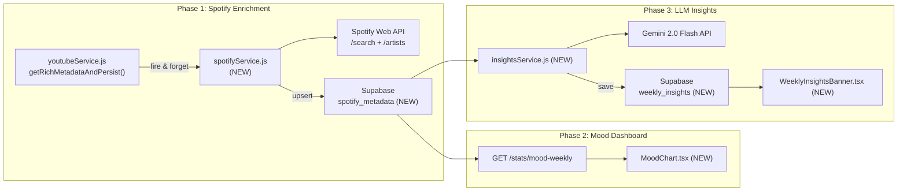
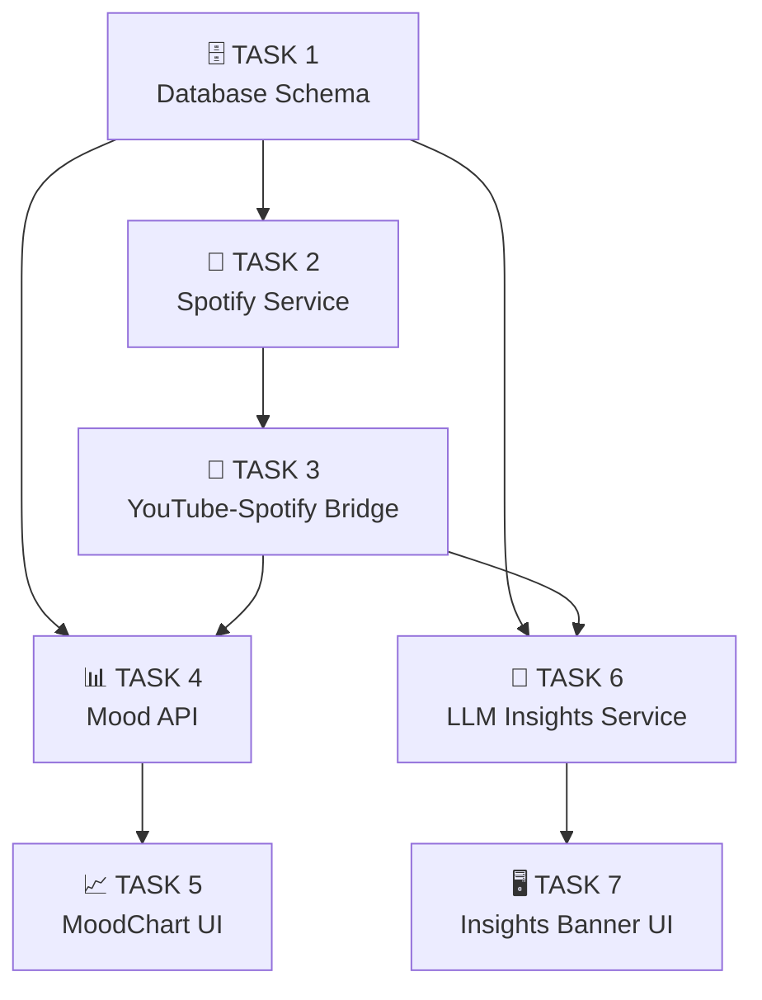
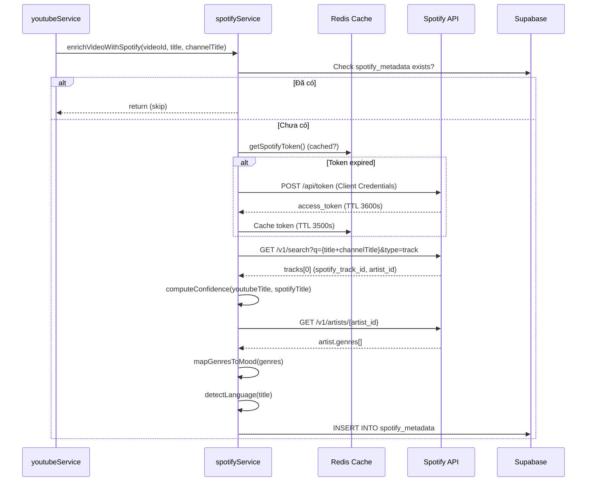

# 📋 Bàn Giao Kỹ Thuật — Nâng Cấp Youtube Tracker

> **Mục tiêu tổng quan**: Tích hợp Spotify API để enrich metadata (genre, mood, artist chính xác), xây biểu đồ cảm xúc tuần, và tạo "Weekly Wrapped Insights" bằng LLM Gemini — tự động phân tích thói quen nghe nhạc hàng tuần.

## Kiến Trúc Tổng Quan (Sau Nâng Cấp)



## Sơ Đồ Phụ Thuộc Giữa Các Task



> [!TIP]
> **TASK 1** là tiên quyết — phải chạy SQL trước khi code bất kỳ thứ gì. Sau đó TASK 2→3 và TASK 4→5 và TASK 6→7 có thể phát triển song song bởi các dev khác nhau.

---

## Chuẩn Bị Chung (Cho Tất Cả Dev)

### Biến Môi Trường Cần Thêm Vào `.env`

```env
# Spotify (https://developer.spotify.com/dashboard → Create App)
SPOTIFY_CLIENT_ID=<your_spotify_client_id>
SPOTIFY_CLIENT_SECRET=<your_spotify_client_secret>

# Gemini (https://aistudio.google.com/app/apikey)
GEMINI_API_KEY=<your_gemini_api_key>
```

### Dependencies Cần Cài

```bash
# Trong thư mục server/
npm install franc-min levenshtein node-cron @google/generative-ai
```

| Package | Mục đích |
|---------|----------|
| `franc-min` | Nhận diện ngôn ngữ từ title bài hát (lightweight) |
| `levenshtein` | Tính string similarity giữa YouTube title và Spotify result |
| `node-cron` | Scheduler chạy batch job Weekly Insights (backup) |
| `@google/generative-ai` | Gemini 2.0 Flash SDK chính thức |

---

# TASK 1: Database Schema Setup 🗄️

| | |
|---|---|
| **Mục tiêu** | Khởi tạo schema hợp nhất (`videos`, `track_metadata`, `weekly_insights`) trên Supabase |
| **Assignee** | Backend / DBA |
| **Ước tính** | 10 phút |
| **File thực thi** | `init.sql` (có sẵn ở thư mục gốc) |

### Bước 1.1: Chạy SQL trên Supabase

1. Mở Supabase Dashboard → SQL Editor
2. Mở file `init.sql`
3. Paste toàn bộ nội dung file này vào SQL Editor và chạy (Run)
4. Verify: vào Table Editor, kiểm tra 3 bảng `videos`, `track_metadata` và `weekly_insights` xuất hiện

### Tiêu Chí Hoàn Thành ✅
- [ ] 3 bảng tồn tại trên Supabase
- [ ] RLS policies active
- [ ] `track_metadata.video_id` có FK constraint đến `videos.video_id`

---

# TASK 2: Spotify Service + Mood Mapping 🎵

| | |
|---|---|
| **Mục tiêu** | Tạo service gọi Spotify Search/Artist API, trích xuất genre, map sang mood |
| **Assignee** | Backend Dev |
| **Ước tính** | 3-4 giờ |
| **File tạo mới** | `server/src/services/spotifyService.js` |
| **Tiền điều kiện** | TASK 1 hoàn thành, có Spotify Client ID/Secret trong `.env` |

### Bước 2.1: Hiểu Luồng Xử Lý



### Bước 2.2: Tạo file `spotifyService.js`

**Vị trí**: `server/src/services/spotifyService.js`

#### Hàm 1: `getSpotifyToken()`

```
Mục đích: Lấy access_token từ Spotify qua Client Credentials flow.
Token KHÔNG gắn với user nào → chỉ cần client_id + client_secret.

Logic:
1. Kiểm tra Redis key "spotify_access_token" 
2. Nếu có → return cached token
3. Nếu không → POST https://accounts.spotify.com/api/token
   - Header: Authorization: Basic base64(client_id:client_secret)
   - Body: grant_type=client_credentials
4. Cache token vào Redis với TTL = 3500 giây (token thật expire sau 3600s)
5. Return access_token
```

#### Hàm 2: `searchTrackOnSpotify(title, channelTitle)`

```
Mục đích: Tìm bài hát trên Spotify từ title YouTube.

Logic:
1. Làm sạch title YouTube:
   - Loại bỏ các cụm: "(Official Video)", "(Lyrics)", "(MV)", "[Official Audio]", 
     "(Vietsub)", "| Official Music Video", "ft.", "feat."
   - Regex: title.replace(/\(.*?\)|\[.*?\]|official|video|lyrics|audio|mv|vietsub/gi, '').trim()
2. Query: GET https://api.spotify.com/v1/search
   - params: { q: `${cleanTitle} ${channelTitle}`, type: 'track', limit: 5, market: 'VN' }
   - Header: Authorization: Bearer {token}
3. Từ kết quả tracks.items[]:
   - Tính match_confidence cho mỗi result bằng Levenshtein distance:
     confidence = 1 - (levenshtein(cleanTitle, spotifyTrackName) / max(len1, len2))
   - Chọn result có confidence cao nhất VÀ >= 0.3 (ngưỡng tối thiểu)
4. Return: { spotify_track_id, artist_id, artist_name, album_name, explicit } hoặc null
```

#### Hàm 3: `getArtistGenres(artistId)`

```
Mục đích: Lấy genres[] từ Spotify Artist object.

Logic:
1. Cache Redis key: "spotify_artist_{artistId}" (TTL 7 ngày — genre ít thay đổi)
2. GET https://api.spotify.com/v1/artists/{artistId}
3. Return artist.genres (array of strings, VD: ["k-pop", "pop", "dance pop"])
```

#### Hàm 4: `mapGenresToMood(genres)`

```
Mục đích: Map array genres → 1 mood category duy nhất.

MOOD_MAP (ĐÃ CỐ ĐỊNH — 8 categories):
{
  "Happy/Upbeat":    ["pop", "dance", "disco", "funk", "reggaeton", "k-pop", "j-pop"],
  "Sad/Melancholic": ["blues", "acoustic", "singer-songwriter", "emo", "folk", "sad"],
  "Energetic":       ["edm", "techno", "drum and bass", "hardstyle", "punk", "rock", "hard rock"],
  "Chill/Relaxed":   ["lo-fi", "lofi", "ambient", "chillhop", "bossa nova", "jazz", "new age", "sleep"],
  "Angry/Intense":   ["metal", "hardcore", "industrial", "grunge", "trap", "death metal"],
  "Romantic/Dreamy": ["r&b", "soul", "indie pop", "dream pop", "shoegaze", "love"],
  "Dramatic/Epic":   ["classical", "soundtrack", "orchestral", "post-rock", "cinematic", "opera"],
  "Party/Dance":     ["house", "trance", "reggae", "latin", "dancehall", "club", "party"]
}

Logic:
1. Với mỗi genre trong genres[]:
   - Lowercase + trim
   - Duyệt qua MOOD_MAP, kiểm tra genre.includes(keyword)
   - Mỗi mood match → tăng score[mood] += 1
2. Chọn mood có score cao nhất
3. Nếu không match gì → return "Unknown"
4. Return tên mood (VD: "Happy/Upbeat")
```

#### Hàm 5: `detectLanguage(title)`

```
Mục đích: Detect ngôn ngữ bài hát từ title.

Logic:
1. import { franc } from 'franc-min'
2. const langCode = franc(title)  // trả "vie", "eng", "kor", "jpn", ...
3. Nếu langCode === 'und' (undetermined) → return "Unknown"
4. Return langCode
```

#### Hàm 6: `enrichVideoWithSpotify(videoId, title, channelTitle)` — Orchestrator

```
Mục đích: Hàm chính, gọi tất cả hàm trên theo thứ tự.

Logic:
1. Check Supabase: SELECT video_id FROM spotify_metadata WHERE video_id = ?
   Nếu đã tồn tại → return (skip, tránh gọi API thừa)
2. const track = await searchTrackOnSpotify(title, channelTitle)
   Nếu null → return (không tìm thấy trên Spotify)
3. const genres = await getArtistGenres(track.artist_id)
4. const mood = mapGenresToMood(genres)
5. const language = detectLanguage(title)
6. INSERT INTO spotify_metadata:
   {
     video_id, spotify_track_id: track.spotify_track_id,
     spotify_artist_id: track.artist_id,
     artist_name: track.artist_name,  ← ĐÂY LÀ ARTIST CHÍNH XÁC
     album_name: track.album_name,
     genres: genres,       // JSONB
     mood: mood,           // "Happy/Upbeat"
     language: language,   // "vie"
     explicit: track.explicit,
     match_confidence: track.confidence  // 0.0-1.0
   }
7. Log: "[Spotify] Enriched videoId={videoId} → mood={mood}, artist={artist_name}"
```

### Tiêu Chí Hoàn Thành ✅
- [ ] Gọi `enrichVideoWithSpotify('dQw4w9WgXcQ', 'Never Gonna Give You Up', 'Rick Astley')` thành công
- [ ] Row mới trong `spotify_metadata` có: `mood='Happy/Upbeat'`, `artist_name='Rick Astley'`, `genres` chứa `["dance pop", "pop"]`
- [ ] Gọi lần 2 → skip (không gọi API lại)
- [ ] Token Spotify được cache trong Redis

---

# TASK 3: YouTube-Spotify Integration Bridge 🔗

| | |
|---|---|
| **Mục tiêu** | Kết nối `youtubeService.js` hiện tại với `spotifyService.js` mới |
| **Assignee** | Backend Dev (có thể cùng dev TASK 2) |
| **Ước tính** | 30 phút |
| **File sửa** | `server/src/services/youtubeService.js` |
| **Tiền điều kiện** | TASK 2 hoàn thành |

### Bước 3.1: Sửa `getRichMetadataAndPersist()` trong `youtubeService.js`

**Vị trí chính xác**: [youtubeService.js dòng 46-48](file:///d:/Đại Học/Năm 3/IE103/Youtube_Tracker/server/src/services/youtubeService.js#L46-L48)

```diff
 // youtubeService.js — hàm getRichMetadataAndPersist()
 // Sau block insert vào Supabase thành công (dòng ~46):

     if (error) {
       console.error('[YoutubeService] Supabase insert error:', error.message);
     } else {
       console.log(`[Supabase] Metadata ingested for AI Dataset: ${videoId} (${title})`);
+
+      // Fire & Forget: Enrich thêm Spotify metadata (genre, mood, artist chính xác)
+      const { enrichVideoWithSpotify } = require('./spotifyService');
+      enrichVideoWithSpotify(videoId, title, channelTitle).catch(err => {
+        console.warn('[Spotify] Enrichment failed (non-blocking):', err.message);
+      });
     }
```

### Tại Sao Fire & Forget?

- Spotify enrichment KHÔNG được block request chính (user đang chờ response từ `/track`)
- Nếu Spotify API fail → không ảnh hưởng tracking flow
- `.catch()` đảm bảo unhandled promise không crash server

### Tiêu Chí Hoàn Thành ✅
- [ ] Khi `POST /track` với 1 video mới → cả `videos` và `spotify_metadata` đều được populate
- [ ] Nếu Spotify API fail → tracking vẫn hoạt động bình thường, chỉ log warning
- [ ] Server không bị chậm thêm khi xử lý `/track`

---

# TASK 4: Mood Weekly API 📊

| | |
|---|---|
| **Mục tiêu** | Backend API trả phân bổ mood theo ngày trong tuần, cho Frontend vẽ biểu đồ |
| **Assignee** | Backend Dev |
| **Ước tính** | 2 giờ |
| **File sửa** | `server/src/index.js` |
| **Tiền điều kiện** | TASK 1 (bảng `spotify_metadata` có data), TASK 3 (đã enrich vài videos) |

### Bước 4.1: Thêm endpoint `GET /stats/mood-weekly`

**Vị trí chèn**: Sau endpoint `/stats` hiện tại (~dòng 335 trong `index.js`)

#### Logic Chi Tiết

```
Input: JWT token (từ authMiddleware → req.userId)
Output: 7 ngày gần nhất, mỗi ngày có breakdown số bài theo mood

Pipeline:
1. Query InfluxDB:
   SELECT video_id, DATE_TRUNC('day', time) as day
   FROM playback_events
   WHERE user_id = '{userId}'
     AND event_type = 'track_completed'
     AND time > now() - interval '7 days'
   
   → Kết quả: [{ video_id: 'abc', day: '2026-04-01' }, ...]

2. Lấy danh sách unique video_id
3. Query Supabase:
   SELECT video_id, mood FROM spotify_metadata WHERE video_id IN (...)
   
   → Tạo moodMap: { 'abc': 'Happy/Upbeat', 'def': 'Chill/Relaxed' }

4. Gom nhóm:
   Với mỗi row InfluxDB:
     - day = row.day (ngày)
     - mood = moodMap[row.video_id] || 'Unknown'
     - Tăng counter: result[day][mood] += 1

5. Format response (đảm bảo ĐỦ 7 ngày, kể cả ngày không có data = {}):
```

#### Cấu Trúc Response

```json
{
  "data": [
    {
      "date": "2026-03-31",
      "day_label": "T2",
      "moods": {
        "Happy/Upbeat": 5,
        "Chill/Relaxed": 3,
        "Energetic": 2,
        "Unknown": 1
      },
      "total": 11
    },
    {
      "date": "2026-04-01",
      "day_label": "T3",
      "moods": {},
      "total": 0
    }
    // ... tổng 7 ngày
  ]
}
```

> [!NOTE]
> `day_label` dùng format Việt Nam: "T2", "T3", "T4", "T5", "T6", "T7", "CN"

### Tiêu Chí Hoàn Thành ✅
- [ ] `GET /stats/mood-weekly` trả đúng 7 phần tử trong `data[]`
- [ ] Mỗi phần tử có `date`, `day_label`, `moods` (object), `total`
- [ ] Ngày không có data → `moods: {}`, `total: 0`
- [ ] Video chưa có Spotify data → mood = "Unknown"

---

# TASK 5: MoodChart UI Component 📈

| | |
|---|---|
| **Mục tiêu** | Vẽ biểu đồ cột xếp chồng (Stacked Bar) hiển thị mood 7 ngày trên Dashboard |
| **Assignee** | Frontend Dev |
| **Ước tính** | 2-3 giờ |
| **Files tạo/sửa** | `MoodChart.tsx` (NEW), `page.tsx` (MODIFY), `api.ts` (MODIFY) |
| **Tiền điều kiện** | TASK 4 hoàn thành (API ready) |

### Bước 5.1: Thêm `fetchMoodWeekly()` vào `api.ts`

**File**: `dashboard/lib/api.ts`

```typescript
export const fetchMoodWeekly = async () => {
  const res = await api.get('/stats/mood-weekly')
  return res.data
}
```

### Bước 5.2: Tạo `MoodChart.tsx`

**File**: `dashboard/components/charts/MoodChart.tsx`

#### Thiết Kế Visual

```
┌──────────────────────────────────────────────┐
│  🎭 Biểu Đồ Cảm Xúc (7 Ngày Gần Nhất)     │
│                                              │
│  12 ┤                                         │
│  10 ┤         ██                              │
│   8 ┤    ██   ██         ██                   │
│   6 ┤    ██   ██    ██   ██              ██   │
│   4 ┤    ██   ██    ██   ██    ██   ██   ██   │
│   2 ┤    ██   ██    ██   ██    ██   ██   ██   │
│   0 ┴────T2───T3────T4───T5────T6───T7───CN── │
│                                              │
│  🟡 Happy  🟣 Sad  🔴 Energetic  🟢 Chill   │
│  🟠 Angry  🩷 Romantic  ⬛ Dramatic  💚 Party│
└──────────────────────────────────────────────┘
```

#### Color Palette (CỐ ĐỊNH)

```typescript
const MOOD_COLORS: Record<string, string> = {
  'Happy/Upbeat':    '#FFD93D',
  'Sad/Melancholic': '#6C5CE7',
  'Energetic':       '#FF6B6B',
  'Chill/Relaxed':   '#4ECDC4',
  'Angry/Intense':   '#E17055',
  'Romantic/Dreamy': '#FD79A8',
  'Dramatic/Epic':   '#2D3436',
  'Party/Dance':     '#00B894',
  'Unknown':         '#B2BEC3',
}
```

#### Thư Viện

Dùng **Recharts** (đã có sẵn trong project). Components cần:
- `<BarChart>`, `<Bar>` (stacked), `<XAxis>`, `<YAxis>`, `<Tooltip>`, `<Legend>`

#### Empty State

Khi chưa có data Spotify (tuần đầu sử dụng), hiển thị:
- Icon 🎵 + text "Chưa có dữ liệu cảm xúc. Nghe thêm nhạc để xem mood chart!"

### Bước 5.3: Tích hợp vào Dashboard `page.tsx`

**File**: `dashboard/app/dashboard/page.tsx`

Thêm vào grid, vị trí **ngay sau SkipRateChart + ContextPieChart** (trước HistoryTable):

```tsx
// Trong phần state
const [moodData, setMoodData] = useState<any[]>([]);

// Trong loadData()
const [histRes, statsRes, moodRes] = await Promise.all([
  fetchHistory(), fetchStats(), fetchMoodWeekly()
]);
setMoodData(moodRes.data || []);

// Trong JSX, trước HistoryTable
<div className="grid grid-cols-1 gap-6">
  <MoodChart data={moodData} />
</div>
```

### Tiêu Chí Hoàn Thành ✅
- [ ] Biểu đồ hiển thị 7 cột (T2→CN) với màu sắc đúng palette
- [ ] Hover tooltip hiển thị breakdown mood + số lượng
- [ ] Legend hiển thị tất cả 8 moods
- [ ] Empty state khi không có data
- [ ] Responsive: stack thành 1 cột trên mobile

---

# TASK 6: LLM Weekly Insights Service 🤖

| | |
|---|---|
| **Mục tiêu** | Backend service query InfluxDB → build JSON stats → gọi Gemini → lưu kết quả. On-Demand + Cron hybrid. |
| **Assignee** | Backend Dev |
| **Ước tính** | 4-5 giờ (task phức tạp nhất) |
| **Files tạo/sửa** | `insightsService.js` (NEW), `index.js` (MODIFY) |
| **Tiền điều kiện** | TASK 1, TASK 3 (cần spotify_metadata có data để mood distribution có ý nghĩa) |

### Bước 6.1: Tạo `insightsService.js`

**File**: `server/src/services/insightsService.js`

#### Hàm 1: `getWeekBoundaries()`

```
Mục đích: Tính Monday→Sunday của TUẦN TRƯỚC.

Logic:
  const now = new Date()
  const dayOfWeek = now.getDay()  // 0=Sun, 1=Mon, ...
  
  // Monday tuần này
  const thisMonday = new Date(now)
  thisMonday.setDate(now.getDate() - (dayOfWeek === 0 ? 6 : dayOfWeek - 1))
  
  // Monday tuần trước = thisMonday - 7
  const lastMonday = new Date(thisMonday)
  lastMonday.setDate(thisMonday.getDate() - 7)
  
  // Sunday tuần trước = thisMonday - 1
  const lastSunday = new Date(thisMonday)
  lastSunday.setDate(thisMonday.getDate() - 1)
  
  Return: { weekStart: lastMonday (DATE), weekEnd: lastSunday (DATE) }
```

#### Hàm 2: `generateWeeklySummaryJSON(userId, weekStart, weekEnd)`

```
Mục đích: Query InfluxDB + Supabase để tạo JSON thống kê tuần.

Cần chạy 6 queries song song (Promise.all):

Q1 — Tổng thời lượng nghe:
  SELECT SUM(ms_played) as total_ms FROM playback_events 
  WHERE user_id='{userId}' AND ms_played > 0 
  AND time >= '{weekStart}' AND time < '{weekEnd + 1 day}'
  → Chuyển ms → giờ: total_ms / 3_600_000

Q2 — Tổng số track completed:
  SELECT COUNT(*) FROM playback_events 
  WHERE user_id='{userId}' AND event_type='track_completed'
  AND time >= '{weekStart}' AND time < '{weekEnd + 1 day}'

Q3 — Top 3 video (theo play_count):
  SELECT video_id, COUNT(*) as play_count, SUM(ms_played) as total_ms
  FROM playback_events WHERE user_id='{userId}'
  AND event_type='track_completed'
  AND time >= '{weekStart}' AND time < '{weekEnd + 1 day}'
  GROUP BY video_id ORDER BY play_count DESC LIMIT 3
  → Join Supabase spotify_metadata + videos để lấy artist_name, title

Q4 — Peak listening hour:
  Lấy tất cả events trong tuần, extract giờ (hour) từ timestamp,
  đếm events theo giờ, tìm cluster 2-3 giờ liên tiếp nhiều nhất
  → Gán label: 
    5-11: "Early Bird 🐦"
    12-17: "Afternoon Listener 🌤️"  
    17-21: "Evening Vibes 🌆"
    22-4:  "Night Owl 🦉"

Q5 — Genre shift (so tuần này vs tuần trước):
  Aggregrate genres từ spotify_metadata cho tracks tuần trước-trước vs tuần trước
  → So sánh top genre 2 tuần

Q6 — Binge track (bài replay nhiều nhất trong window ngắn):
  SELECT video_id, COUNT(*) as play_count FROM playback_events
  WHERE event_type IN ('track_completed', 'replay')
  AND time >= '{weekStart}' AND time < '{weekEnd + 1 day}'
  GROUP BY video_id ORDER BY play_count DESC LIMIT 1

Q7 — Mood distribution:
  Lấy tất cả video_id tracks completed tuần → join spotify_metadata.mood
  → count theo mood category

Q8 — Skip rate + completion rate:
  Đếm skip, skip_early, track_completed, play → tính tỷ lệ
```

**Output JSON** (đây chính là input cho LLM):
```json
{
  "user_id": "abc-123",
  "week_start": "2026-03-30",
  "week_end": "2026-04-05",
  "total_listening_hours": 25.3,
  "total_tracks_played": 187,
  "top_3_artists": [
    { "name": "The Weeknd", "play_count": 32, "total_hours": 4.2 }
  ],
  "peak_listening_hours": {
    "start": "22:00", "end": "02:00", "label": "Night Owl 🦉"
  },
  "genre_shift": {
    "last_week_top": "Pop",
    "this_week_top": "Lo-fi",
    "direction": "shift_to_chill"
  },
  "binge_track": {
    "title": "Blinding Lights",
    "artist": "The Weeknd",
    "replay_count": 12
  },
  "mood_distribution": {
    "Happy/Upbeat": 45,
    "Chill/Relaxed": 30
  },
  "skip_rate": 0.23,
  "completion_rate": 0.71
}
```

#### Hàm 3: `callGemini(summaryJSON)`

```
Mục đích: Gọi Gemini 2.0 Flash API và trả về wrapped text.

Logic:
1. import { GoogleGenerativeAI } from '@google/generative-ai'
2. const genAI = new GoogleGenerativeAI(process.env.GEMINI_API_KEY)
3. const model = genAI.getGenerativeModel({ model: 'gemini-2.0-flash' })

4. Prompt template (CỐ ĐỊNH — đặt thành const PROMPT_TEMPLATE):

"""
Bạn là một Music Curator cá nhân, giọng văn vui vẻ, dí dỏm và thân thiện.
Hãy viết một bản "Weekly Wrapped" ngắn gọn (150-200 từ) bằng tiếng Việt 
dựa trên dữ liệu nghe nhạc dưới đây.

Yêu cầu bắt buộc:
1. Mở đầu bằng 1 câu summary ấn tượng, bất ngờ về tuần nghe nhạc
2. Highlight top artist và bình luận vì sao họ nổi bật tuần này
3. Bình luận về khung giờ nghe chủ đạo (đêm/sáng → nhận xét tính cách playful)
4. Nếu có genre shift → bình luận sự thay đổi tâm trạng một cách hài hước
5. Nếu có binge track (replay > 5 lần) → đùa vui về bài "nghiện"
6. Nhận xét mood tổng thể dựa trên mood_distribution
7. Kết bằng 1 câu khuyến khích hoặc gợi ý nhẹ nhàng cho tuần mới
8. Dùng emoji phù hợp xuyên suốt
9. KHÔNG dùng markdown (heading, bold, list). Chỉ dùng plain text + emoji.
10. KHÔNG bịa thêm dữ liệu không có trong JSON.

Dữ liệu tuần:
{WEEKLY_JSON}
"""

5. const result = await model.generateContent(prompt)
6. return result.response.text()
```

#### Hàm 4: `getOrGenerateWeeklyInsight(userId)` — THE CORE

```
Mục đích: On-Demand logic — check DB → return nếu có → generate nếu chưa.

Logic:
1. const { weekStart, weekEnd } = getWeekBoundaries()  // tuần TRƯỚC

2. SELECT * FROM weekly_insights 
   WHERE user_id = '{userId}' AND week_start = '{weekStart}'
   
3. Nếu có record:
   → return { wrapped_text, summary_json, cached: true }
   (NHANH: ~50ms, không gọi InfluxDB hay Gemini)

4. Nếu KHÔNG có:
   a. const summaryJSON = await generateWeeklySummaryJSON(userId, weekStart, weekEnd)
   b. Kiểm tra: nếu summaryJSON.total_tracks_played === 0
      → return { wrapped_text: "Tuần trước bạn chưa nghe bài nào...", cached: false }
   c. const wrappedText = await callGemini(summaryJSON)
   d. INSERT INTO weekly_insights (user_id, week_start, week_end, summary_json, wrapped_text)
      VALUES ('{userId}', '{weekStart}', '{weekEnd}', '{summaryJSON}', '{wrappedText}')
      ON CONFLICT (user_id, week_start) DO NOTHING  -- tránh race condition 2 tab mở cùng lúc
   e. return { wrapped_text: wrappedText, summary_json: summaryJSON, cached: false }
```

### Bước 6.2: Thêm API + Cron vào `index.js`

#### API Endpoint: `GET /insights/weekly`

```javascript
app.get('/insights/weekly', authMiddleware, async (req, res) => {
  try {
    const { getOrGenerateWeeklyInsight } = require('./services/insightsService');
    const result = await getOrGenerateWeeklyInsight(req.userId);
    return res.status(200).json({ data: result });
  } catch (error) {
    console.error('[/insights/weekly] Error:', error.message);
    return res.status(500).json({ error: 'Internal server error', message: error.message });
  }
});
```

#### Cron Job (Backup — Monday 00:00)

```javascript
const cron = require('node-cron');

// Chạy vào 00:00 sáng thứ Hai hàng tuần (backup cho On-Demand)
cron.schedule('0 0 * * 1', async () => {
  console.log('[Cron] Weekly Insights batch job started...');
  // TODO: Query danh sách active user_ids từ InfluxDB
  // Với mỗi userId: gọi getOrGenerateWeeklyInsight(userId)
  // Log kết quả
});
```

> [!IMPORTANT]
> Cron chỉ là **backup**. Luồng chính là On-Demand khi user mở dashboard.

### Tiêu Chí Hoàn Thành ✅
- [ ] `GET /insights/weekly` lần đầu: response time ~5-15s, trả `cached: false`
- [ ] `GET /insights/weekly` lần 2+: response time <200ms, trả `cached: true`
- [ ] `wrapped_text` bằng tiếng Việt, có emoji, 150-200 từ
- [ ] `summary_json` chứa đủ 8 fields thống kê
- [ ] 2 tab mở cùng lúc → không tạo duplicate trong DB (nhờ `ON CONFLICT DO NOTHING`)

---

# TASK 7: Weekly Insights Banner UI 🖥️

| | |
|---|---|
| **Mục tiêu** | Component banner đầu trang Dashboard hiển thị Weekly Wrapped text + Skeleton loading |
| **Assignee** | Frontend Dev |
| **Ước tính** | 2-3 giờ |
| **Files tạo/sửa** | `WeeklyInsightsBanner.tsx` (NEW), `page.tsx` (MODIFY), `api.ts` (MODIFY) |
| **Tiền điều kiện** | TASK 6 hoàn thành (API ready) |

### Bước 7.1: Thêm `fetchWeeklyInsights()` vào `api.ts`

```typescript
export const fetchWeeklyInsights = async () => {
  const res = await api.get('/insights/weekly')
  return res.data
}
```

### Bước 7.2: Tạo `WeeklyInsightsBanner.tsx`

**File**: `dashboard/components/dashboard/WeeklyInsightsBanner.tsx`

#### Thiết Kế Visual

**State 1 — Loading (Skeleton):**
```
┌─────────────────────────────────────────────────────────┐
│  ✨ Your Weekly Insights                                │
│  ┌──────────────────────────────────────────────────┐   │
│  │  ████████████████████████████░░░░░░░░░░░░░░░░░░  │   │
│  │  ██████████████████████░░░░░░░░░░░░░░░░░░░░░░░░  │   │
│  │  █████████████████████████████░░░░░░░░░░░░░░░░░  │   │
│  └──────────────────────────────────────────────────┘   │
│  🔄 Đang phân tích thói quen nghe nhạc tuần qua...     │
└─────────────────────────────────────────────────────────┘
```

**State 2 — Loaded (Content):**
```
┌─────────────────────────────────────────────────────────┐
│  ✨ Your Weekly Insights                    [Thu gọn ▲] │
│                                                         │
│  🎵 Tuần này bạn đã "cháy" 25 giờ với âm nhạc! The     │
│  Weeknd chiếm spotlight với 32 lần play — có vẻ bạn     │
│  đang sống trong album After Hours rồi đó 😄 Đặc biệt  │
│  bạn hay nghe nhạc từ 22h-2h sáng — đúng chất "cú       │
│  đêm" thứ thiệt 🦉 ...                                  │
│                                                         │
│  📊 Top Artist: The Weeknd • Taylor Swift • Hans Zimmer │
└─────────────────────────────────────────────────────────┘
```

**State 3 — Empty (No data):**
```
┌─────────────────────────────────────────────────────────┐
│  ✨ Your Weekly Insights                                │
│  🎧 Tuần trước bạn chưa nghe bài nào. Hãy mở YouTube  │
│  và bắt đầu hành trình âm nhạc nào!                     │
└─────────────────────────────────────────────────────────┘
```

#### Props Interface

```typescript
interface WeeklyInsightsBannerProps {
  // Không cần props — component tự fetch data
}

// Internal state:
// - status: 'loading' | 'loaded' | 'empty' | 'error'
// - insightText: string
// - summaryStats: object (top artists, hours, etc.)
// - isExpanded: boolean (collapse/expand)
```

#### Skeleton Loading Implementation

```
3 dòng animated gradient bar:
- width: 90%, 75%, 85% (khác nhau để trông tự nhiên)
- animation: shimmer (background linear-gradient moving left→right)
- duration: 1.5s infinite
```

#### Styling
- Background: gradient `from-amber-500/10 to-orange-500/10` (warm tone, khác với NowPlayingCard)
- Border-left: 4px solid amber-500
- Border-radius: 16px
- Collapse animation: `max-height` transition

### Bước 7.3: Tích hợp vào Dashboard `page.tsx`

**Vị trí**: ĐẦU TIÊN, TRƯỚC NowPlayingCard

```tsx
import WeeklyInsightsBanner from '@/components/dashboard/WeeklyInsightsBanner';

// Trong JSX, dòng đầu tiên sau heading:
<WeeklyInsightsBanner />

<div className="grid grid-cols-1 lg:grid-cols-3 gap-6">
  <NowPlayingCard liveEvent={liveEvent} />
</div>
// ... rest of dashboard
```

> [!NOTE]
> `WeeklyInsightsBanner` tự fetch data riêng (useEffect nội bộ), không phụ thuộc vào `loadData()` của page — vì insight lần đầu mất 5-15s, không nên block toàn bộ dashboard.

### Tiêu Chí Hoàn Thành ✅
- [ ] Skeleton loading hiển thị ngay khi vào dashboard
- [ ] Sau 5-15s (lần đầu) hoặc <1s (lần sau) → nội dung wrapped text hiển thị
- [ ] Button thu gọn/mở rộng hoạt động smooth
- [ ] Empty state khi không có data tuần trước
- [ ] Responsive: text wrap đúng trên mobile
- [ ] Không block phần còn lại của dashboard trong khi loading

---

## Tóm Tắt Toàn Bộ Deliverables

| Task | File(s) | Loại | Dev | Estimate |
|------|---------|------|-----|----------|
| 1 | `setup_spotify_metadata.sql`, `setup_weekly_insights.sql` | NEW | DBA | 30m |
| 2 | `server/src/services/spotifyService.js` | NEW | BE | 3-4h |
| 3 | `server/src/services/youtubeService.js` | MODIFY | BE | 30m |
| 4 | `server/src/index.js` (thêm `/stats/mood-weekly`) | MODIFY | BE | 2h |
| 5 | `MoodChart.tsx`, `page.tsx`, `api.ts` | NEW+MODIFY | FE | 2-3h |
| 6 | `server/src/services/insightsService.js`, `index.js` | NEW+MODIFY | BE | 4-5h |
| 7 | `WeeklyInsightsBanner.tsx`, `page.tsx`, `api.ts` | NEW+MODIFY | FE | 2-3h |
| **ENV** | `.env.example` | MODIFY | Any | 5m |
| **Total** | | | | **~15-18h** |
