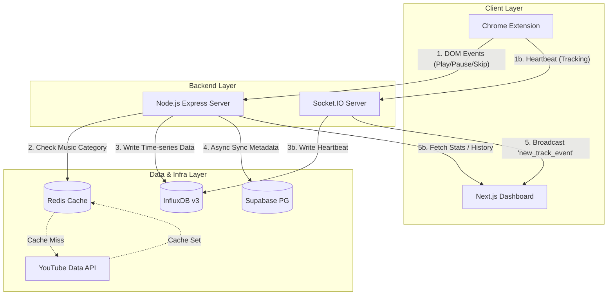

# 📑 TECHNICAL HANDOVER DOCUMENT: YOUTUBE TRACKER 

## 1. Project Overview & Business Logic (Tổng quan & Nghiệp vụ cốt lõi)

**Tổng quan:**  
YouTube Tracker v2.0 là một hệ thống theo dõi và phân tích hành vi nghe nhạc trên YouTube theo thời gian thực (Real-time). Hệ thống tận dụng Chrome Extension để giám sát quá trình xem video, gửi telemetry data về backend xử lý siêu tốc, lưu trữ bằng chuỗi thời gian (influxDB), và hiển thị thống kê chuyên sâu lên Dashboard trực quan tương tự trải nghiệm "Spotify Wrapped".

**Core Use-cases (Nghiệp vụ chính):**
1. **Theo dõi dữ liệu nghe (Deep Tracking):** Khi người dùng xem video trên YouTube, quá trình Play, Pause, Skip, hay Replay được tính toán chi tiết (đo đếm tỷ lệ hoàn thành video, số ms đã xem).
2. **Kiểm duyệt & Lọc nhạc:** Hệ thống tự động phân loại video thông qua YouTube Data API, chỉ lưu trữ log nếu video đó thuộc danh mục Âm nhạc (Music), loại bỏ các video rác hoặc podcast.
3. **Phân tích ngữ cảnh người dùng:** Ghi nhận nguồn click (từ trang chủ, tìm kiếm, hay gợi ý) và thời điểm nghe (sáng, trưa, tối, đêm) để vẽ biểu đồ phân phối thời gian.
4. **Phản hồi Real-time:** Ngay khi có tương tác bài hát, Dashboard sẽ chớp tín hiệu "Now Playing" và update biểu đồ lập tức thông qua WebSocket.

---

## 2. Tech Stack & Environment (Công nghệ & Môi trường)

Hệ thống được thiết kế theo hướng **Decoupled Architecture**, phân tách rõ ràng các service.

| Component | Technology | Role |
| :--- | :--- | :--- |
| **Frontend Web** | Next.js 16 (App Router), Tailwind CSS v4, Recharts | Dashboard thống kê, SSR Auth, Interactive UI |
| **Agent / Client** | Chrome Extension (Manifest V3) | DOM Hook, Event Capture, Sync Auth Cookie |
| **Backend API** | Node.js, Express, Socket.IO | Stream Receiver, Logic Processor, Real-time Broadcaster |
| **Time-series DB** | InfluxDB v3 Core | Lưu trữ hàng triệu bản ghi sự kiện tracking (Tốc độ ghi siêu cao) |
| **Relational DB / Auth**| Supabase (PostgreSQL) | Quản lý User Authentication, Lưu trữ Metadata Video chuẩn hóa |
| **Cache Layer** | Redis | Caching API response của YouTube, giảm tải Request Quota |

**Lý do lựa chọn Tech Stack:**
- **InfluxDB thay vì PostgreSQL cho Log:** Khối lượng tracking events bắn liên tục theo từng giây (Heartbeat/Stream) sẽ gây lock table và chai I/O nếu dùng SQL truyền thống. InfluxDB tối ưu cho Time-Series.
- **Supabase cho Auth & Meta:** Rút ngắn thời gian dev Auth logic. Quản lý metadata video bằng SQL để dễ dàng Join với Data warehouse về sau cho ML Model.
- **Chrome Extension (DOM Inject):** Là giải pháp duy nhất trên PC để theo dõi chi tiết (thậm chí handle được Phantom Pause của trình duyệt) mà không bị phụ thuộc vào API đóng của YouTube.

---

## 3. System Architecture & Data Pipeline (Kiến trúc & Luồng dữ liệu)

### Sơ đồ kiến trúc (Architecture Diagram)


(hoặc dùng mermaid nhìn cho trực quan)


### Chi tiết luồng Dữ liệu (Pipeline):
1. **Event Capture:** Content script [content.js] inject vào trang YouTube, lắng nghe đối tượng `<video>`. Khi có sự kiện nổi bật hoặc đạt ngưỡng, gửi Payload kèm JWT token lên Backend API hoặc bắn qua Heartbeat Socket.
2. **Validation:** Backend nhận `videoId` -> Check Redis xem đã phân loại chưa. Nếu chưa, gọi qua YouTube API v3. Nếu không phải nhạc (Category ID != 10) -> Dropped.
3. **Ingestion:** Dữ liệu hợp lệ được map thành Point và ghi ngay lập tức vào **InfluxDB** (Measurement: `playback_events`).
4. **Metadata Persist:** Backend gọi ngầm (Fire & Forget) YouTube API lấy chi tiết bài hát (Title, Artist...) và UPSERT vào bảng `videos` trên **Supabase** để làm dữ liệu train AI sau này.
5. **Real-time Broadcast:** Server Socket.IO phân phát event `new_track_event` đến room riêng của user (`user:userId`).
6. **Visualization:** Next.js Dashboard bắt event từ Socket, render lại card Now Playing và gọi lại API `/stats` để vẽ lại biểu đồ bằng Recharts.

---

## 4. Core Methodologies & Algorithms (Phương pháp & Thuật toán cốt lõi)

Tham khảo code trong content.js và index.js

- **Thuật toán "Deep Tracking" (Watch Duration Ratio):**
  Hệ thống duy trì biến `accumulatedMs`. Tỷ lệ xem `Ratio = accumulatedMs / videoDuration`.
  - Nếu `Ratio >= 0.9` -> event `track_completed`.
  - Nếu User click đổi thẻ nhưng `Ratio < 0.1` -> event `skip_early`.
  - Còn lại -> event `skip`.
- **Debounce Phanton Pause (Chống dội):**
  Khi User chuyển tab, Chrome tự động ép thẻ YouTube Pause ngầm nhằm tiết kiệm RAM. Để tránh hiểu lầm user bấm Pause, content script dùng `setTimeout` 1.5s delay xử lý Pause. Nếu sau 1.5s video đã play lại nghĩa là Phantom Pause -> Ignored.
- **Replay Detection (Bắt vòng lặp):** 
  Nếu thời gian hiện tại của video `< 3s` nhưng thời điểm ngay trước đó (lastTime) là `> 90%` thời lượng video -> Đánh dấu là 1 lượt Replay bài hát. Ngăn chặn bug chỉ tính 1 lần Play duy nhất cho loop.
- **Context Distribution (Bối cảnh):**
  Chuyển đổi Timestamp theo Timezone máy khách để gán thẻ `time_of_day` (Morning, Afternoon, Evening, Night). Dùng cho thuật toán gợi ý nhạc phù hợp theo khung giờ.
- **Tracking cơ bản:**
  - **Playback Events:** Móc thẳng vào sự kiện HTML5 Audio/Video gốc qua tag `<video class="html5-main-video">`. Các event native `play` (phát nhạc) và `pause` (dừng nhạc) được gửi kèm theo số mili-giây đã nghe thực tế kể từ lần Play gần nhất.
  - **UI / Contextual Events:** Kỹ thuật **Event Delegation** được sử dụng để bắt các click tại `document.body`. Khi User tương tác với giao diện như thả tim (`like`), không thích (`dislike`), hoặc thêm playlist (`add_playlist`), extension nội suy từ ID class UI tương ứng (ví dụ: `like-button-view-model`) để bắn tracking.
  - **Chống kỹ thuật Web SPA (Single Page Application):** Sử dụng `MutationObserver` để giám sát thanh `location.href`. Khi User nhấn vào URL khác để chuyển bài, nếu trình duyệt không f5 (refresh), Listener cũ vẫn bị "mù". Do đó observer này sẽ ép chốt số liệu bài hiện tại và bind Event Listener lên bài mới tự động.


---
## API Reference

Tất cả Protected routes yêu cầu header: `Authorization: Bearer <JWT>`

| Method | Endpoint | Auth | Mô tả |
|--------|----------|------|--------|
| `GET` | `/health` | ❌ | Health check, số socket đang kết nối |
| `POST` | `/track` | ✅ | Ghi sự kiện tracking (play, pause, skip, track_completed...) |
| `GET` | `/history` | ✅ | 100 sự kiện gần nhất, kèm metadata từ Supabase |
| `GET` | `/history/daily?date=YYYY-MM-DD` | ✅ | Lịch sử nghe theo ngày cụ thể, gộp ms_played & play_count |
| `GET` | `/stats` | ✅ | Tổng hợp: daily_ms (7 ngày), skip_rate, top 5 tuần/tháng, context distribution |
| `GET` | `/recommend` | ✅ | Gợi ý bài hát (YouTube related videos), cache Redis 1h |

### Socket.IO Events

| Event | Hướng | Payload |
|-------|-------|---------|
| `connected` | Server → Client | `{ userId, socketId }` |
| `tracking_heartbeat` | Client → Server | `{ video_id, current_time, playing, rate }` |
| `new_track_event` | Server → Client | `{ videoId, eventType, timestamp }` |

---
## 5. Database Schema (Cấu trúc dữ liệu)

### InfluxDB – Measurement: `playback_events`

| Loại | Trường | Kiểu | Ý nghĩa |
|------|--------|------|---------|
| Tag | `user_id` | string | ID user từ Supabase |
| Tag | `video_id` | string | YouTube video ID |
| Tag | `event_type` | string | play / pause / skip / skip_early / track_completed / replay |
| Tag | `session_id` | string | UUID phiên làm việc |
| Tag | `click_source` | string | direct / search / recommendation / home / external |
| Tag | `time_of_day` | string | morning / afternoon / evening / night |
| Tag | `day_of_week` | string | Monday - Sunday |
| Field | `ms_played` | integer | Milliseconds đã nghe |
| Field | `playback_rate` | float | Tốc độ phát (1.0 = bình thường) |
| Field | `watch_duration_ratio` | float | Tỷ lệ hoàn thành (0.0 → 1.0) |
| Field | `replay_count` | integer | Số lần replay |

### Supabase PostgreSQL – Table: `public.videos`

| Column | Type | Mô tả |
|--------|------|-------|
| `video_id` | TEXT (PK) | YouTube video ID |
| `title` | TEXT | Tiêu đề video |
| `artist` | TEXT | Tên kênh / nghệ sĩ |
| `category_id` | TEXT | ID danh mục YouTube |
| `category_name` | TEXT | Tên danh mục (Music, Entertainment...) |
| `duration_iso` | TEXT | Thời lượng ISO 8601 (PT4M13S) |
| `tags` | JSONB | Mảng tags của video |
| `created_at` | TIMESTAMPTZ | Thời điểm tạo bản ghi |

---

## 6. Directory Structure (Cấu trúc thư mục Source Code)

```text
Youtube_Tracker/
├── dashboard/                   --> [FRONTEND NEXT.JS]
│   ├── app/                     --> App Router (Pages & Layout)
│   │   ├── dashboard/           --> Giao diện Analytics chính
│   │   └── login/               --> Trang đăng nhập Supabase Auth
│   ├── components/              
│   │   ├── charts/              --> Biểu đồ Recharts 
│   │   ├── dashboard/           --> Các Widget hiển thị
│   │   └── history/             --> Bảng dữ liệu thô
│   └── lib/                     --> Utilities (Supabase client, fetch API)
├── extension/                   --> [CHROME EXTENSION]
│   ├── background.js            --> Worker ngầm: Sync Auth, Call Tracking API
│   ├── content.js               -->DOM Inject: Lắng nghe HTML5 Video events
│   ├── popup.html/js            --> UI khi click vào icon Extension
│   └── manifest.json            --> Cấu hình quyền (Manifest V3)
└── server/                      --> [BACKEND NODE.JS]
    ├── src/
    │   ├── db/                  --> Kết nối InfluxDB & Redis
    │   ├── middleware/          --> Xác thực rTokenSupabase (Auth JWT)
    │   ├── services/            --> Hàm gọi YouTube Data API
    │   ├── sockets/             --> Xử lý kết nối Real-time Socket.IO
    │   └── index.js             --> Main Express App & Routes
    └── .env                     --> Cấu hình Port, Keys, DB Token
```

---

## 7. Current Status & Next Steps (Trạng thái dự án)

**Đã hoàn thiện (Sẵn sàng Production Core):**
- Cơ chế Tracking bám sát thời lượng (Deep tracking) không trượt ms nào.
- Luồng Data ingestion cực khỏe với InfluxDB + Redis Cache chống spam.
- Real-time Pipeline tới Dashboard hoạt động mượt mà (chớp nháy bài hát ngay khi Play).
- Kiến trúc Auth Sync tự động (Đăng nhập web -> Extension tự nhận diện).

**Next Steps cho Team mới (Gợi ý):**
1. **AI Recommendation System:** Tận dụng bảng `videos` ở Supabase và lịch sử InfluxDB để build Model Collaborative Filtering (Gợi ý nhạc cá nhân hóa). Hiện tại API `/recommend` mới chỉ lấy `relatedToVideoId` cơ bản của YouTube API.
2. **Dashboard Refinement:** Thêm bộ định thời để filter thống kê theo Range (Customize Date Range) trên Dashboard, thay vì mặc định 7 ngày/30 ngày.
3. **Containerization:** Viết file `docker-compose.yml` gom chung Server, Redis, NextJS để 1 click push lên Server.

##  Kịch bản Test End-to-End

1. Mở Dashboard tại `http://localhost:3000` → Đăng nhập (hoặc mở bằng extension)
2. Mở tab YouTube → Play 1 bài hát bất kỳ
3. **Kết quả mong đợi:**
   - Dashboard hiển thị **NowPlaying toast** ngay khi video bắt đầu phát
   - Sau khi Pause / chuyển bài, dữ liệu được ghi vào InfluxDB
   - Biểu đồ trên Dashboard tự reload sau ~2s
4. Chuyển đổi nhiều bài: kiểm tra event `skip` / `skip_early` / `track_completed` trong History Table